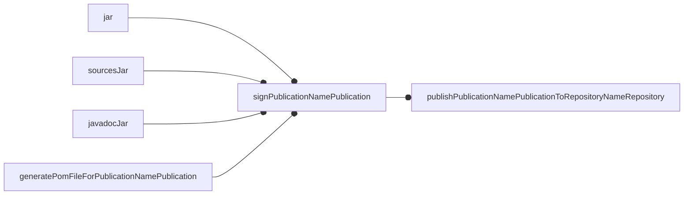
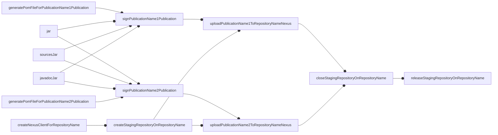

# publish-on-central
A Gradle plugin for streamlined publishing on Maven Central
(and other Maven / Nexus repositories).
This plugin is meant to provide an even easier configuration than
[`io.github.gradle-nexus:publish-plugin`](https://github.com/gradle-nexus/publish-plugin)
(from which this plugin depends),
with the goal of supporting highly automated workflows with minimal configuration.

## Rationale
Publishing on Maven Central requires too much configuration?
Well, I agree.
This plugin is here to simplify your life by automatically
scanning all the software components produced by any plugin,
configuring a corresponding publication,
filling all the information required by OSSRH,
configuring tasks for generating javadoc and source jar files,
activating the signing plugin,
and preparing tasks to upload, close, and release the artifact.

This plugin supports both targets that use Sonatype Nexus (such as Maven Central)
and targets that do not, such as GitHub Packages.

## Configuration

### Minimal

Add `MAVEN_CENTRAL_USERNAME` and `MAVEN_CENTRAL_PASSWORD` to your environment

```kotlin
plugins {
    id ("org.danilopianini.publish-on-central") version "<pick the latest>"
}
group = "your.group.id" // This must be configured for the generated pom.xml to work correctly
publishOnCentral {
  projectUrl.set("https://github.com/DanySK/${project.name}")
  scmConnection.set("git:git@github.com:DanySK/${project.name}")
}
publishing {
  publications {
    withType<MavenPublication> {
      pom {
        developers {
          developer {
            name.set("Danilo Pianini")
            email.set("danilo.pianini@gmail.com")
            url.set("http://www.danilopianini.org/")
          }
        }
      }
    }
  }
}
signing {
  val signingKey: String? by project
  val signingPassword: String? by project
  useInMemoryPgpKeys(signingKey, signingPassword)
}
```

### Complete


```kotlin
plugins {
    id ("org.danilopianini.publish-on-central") version "<pick the latest>"
}
```

The plugin is configured to react to the application of the `java` plugin,
and to apply the `maven-publish` and `signing` plugin if they are not applied.

```kotlin
// The package name is equal to the project name
group = "your.group.id" // This must be configured for the generated pom.xml to work correctly
/*
 * The plugin comes with defaults that are useful to myself. You should configure it to behave as you please:
 */
publishOnCentral {
    // Set to false if you do not want the MavenCentral repository to be automatically configured
    configureMavenCentral.set(true)
    // The following values are the default, if they are ok with you, just omit them
    projectDescription.set("No description provided")
    projectLongName.set(project.name)
    licenseName.set("Apache License, Version 2.0")
    licenseUrl.set("http://www.apache.org/licenses/LICENSE-2.0")
    repoOwner.set("DanySK") // Used to populate the default value for projectUrl and scmConnection
    projectUrl.set("https://github.com/${repoOwner}/${project.name}")
    scmConnection.set("scm:git:https://github.com/${repoOwner}/${project.name}")
    /*
     * The plugin is pre-configured to fetch credentials for Maven Central from the context in the following order:
     * 1. Environment variables MAVEN_CENTRAL_USERNAME and MAVEN_CENTRAL_PASSWORD
     * 2. Project properties mavenCentralUsername and mavenCentralPassword
     * 3. Project properties sonatypeUsername and sonatypePassword
     * 4. Project properties ossrhUsername and ossrhPassword
     * 
     * They can be further customized through values or providers:
     */
    mavenCentral.user.set("...")
    mavenCentral.password.set(provider { "..." })

    /*
     * The publications can be sent to other destinations, e.g. GitHub
     * The task name would be 'publishAllPublicationsToGitHubRepository'
     */
    repository("https://maven.pkg.github.com/OWNER/REPOSITORY", "GitHub") {
        user.set(System.getenv("GITHUB_USERNAME"))
        password.set(System.getenv("GITHUB_TOKEN"))
    }
  
    /*
     * Here is an example of a repository with a custom Nexus instance
     */
    repository("https://some/valid/repo/with/nexus", "MyNexus") {
        user.set(mavenCentral.user) // mavenCentral is accessible for 
        password.set(System.getenv("GITHUB_TOKEN"))
        nexusUrl = "https://some/valid/nexus/instance"
        // nexusTimeOut and nexusConnectionTimeOut can be configured, too.
    }
    /*
     * A simplified handler is available for publishing on the Snapshots repository of Maven Central
     */
    if (project.version.endsWith("-SNAPSHOT")) { // Avoid stable versions being pushed there...
      mavenCentralSnapshotsRepository() // Imports user and password from the configuration for Maven Central
      // mavenCentralSnapshotsRepository() {
      //     ...but they can be customized as per any other repository
      // }
    }
}

/*
 * Developers and contributors must be added manually
 */
publishing {
    publications {
        withType<MavenPublication> {
            pom {
                developers {
                    developer {
                        name.set("Danilo Pianini")
                        email.set("danilo.pianini@gmail.com")
                        url.set("http://www.danilopianini.org/")
                    }
                }
            }
        }
    }
}
/*
 * The plugin automatically adds every publication to the list of objects to sign
 * The configuration of the signing process is left to the user, though,
 * as in a normal Gradle build.
 * In the following example, in-memory signing is configured.
 * For further options, please refer to: https://docs.gradle.org/current/userguide/signing_plugin.html
 */
signing {
    val signingKey: String? by project
    val signingPassword: String? by project
    useInMemoryPgpKeys(signingKey, signingPassword)
}
```

## Kotlin Multiplatform

This plugin can configure Kotlin Multiplatform projects, too, but it needs further configuration.
The reason is that the Kotlin Multiplatform plugin creates custom publications under the hood,
and simply creating additional publications based on the `SoftwareComponent`s
(as this plugin does)
does not collect all the required artifacts.

Since version 2.0.0, this plugin marks its publications as `[SoftwareComponentName]OSSRH`,
making it easy to distinguish them by name.

To configure a Kotlin multiplatform project for execution with publish-on-central, use:

```kotlin
publishOnCentral {
    // Same as any other publication, see the previous sections.
}

publishing {
  publications {
    publications.withType<MavenPublication>().configureEach {
      if ("OSSRH" !in name) {
        artifact(tasks.javadocJar)
      }
    }
  }
}
```

Unfortunatly, the Kotlin Multiplatform pre-initializes a sources jar, but not a javadoc jar,
and Gradle does not allow to inspect the pom packaging or the artifact list without finalizing the publication
(thus, preventing metadata to get generated).

Consequently, at the moment, the plugin only preconfigures the POM file and the signing.

## Tasks

* `sourcesJar`: a `Jar` task preconfigured to collect and pack `allSource` from the `main` source set
* `javadocJar`: a `Jar` task preconfigured to
    1. Detect if a javadoc tasks exists, and in case depend on it, and pack its output folder
    2. Detect if a dokkaJavadoc tasks exists, and to the same as above
* One publishing task for each combination of `SoftwareComponent` and repository,
  unless manually deactivated, a `MavenCentral` repository is created by default.
* One publishing task for publishing `All` software components to any target repository
* For every repository with an associated Sonatype Nexus instance, additional tasks are generated to control the
  creation, upload, closure, and release of staging repositories.

### Non-Nexus publishing

Launching the `publish[PublicationName]PublicationTo[RepositoryName]Repository` triggers the creation of the required components,
their signing, and the upload on the target repository.



### Nexus publishing

Nexus publishing is a bit more elaborate.
It requires to select:
1. the operation that must be performed (among simple upload, repository closure, and repository release), and
2. the packages that will be uploaded

Typical invocations could be:

* `./gradlew uploadAllPublicationsToMavenCentralNexus`
  * Simply uploads all publications on a single staging repository
* `./gradlew uploadAllPublicationsToMavenCentralNexus closeStagingRepositoryOnMavenCentral`
  * Uploads all artifacts and closes the repository
* `./gradlew uploadAllPublicationsToMavenCentralNexus releaseStagingRepositoryOnMavenCentral`
  * Uploads all artifacts, closes, and releases the repository
* `./gradlew uploadAllPublicationsToMavenCentralNexus closeStagingRepositoryOnMavenCentral dropStagingRepositoryOnMavenCentral `
  * Uploads all artifacts, closes the repository, then drops it (dry-deploy)

The idea is that the packages to be uploaded must be selected by picking the right set of
`upload[Publication]To[Repo]Nexus` tasks,
and then if further operations are required, either `closeStagingRepositoryOnMavenCentral` or
`releaseStagingRepositoryOnMavenCentral` can be used to close/release.

The following schema shows the dependencies among tasks in case of upload on Nexus of a project with two publications
(e.g., a Kotlin-multiplatform project)



## Multi-stage upload

This plugin, during the execution of the `createStagingRepositoryOn[Repo]` task, exports the staging repository ID in
the format `[Repo]StagingRepositoryId` as an output of the step.

Using this output, it is possible, from other jobs, to upload artifacts to the same staging repository by using the
`stagingRepositoryId` gradle property.

An example below shows how to use this feature to upload artifacts to a staging repository from a different job.

```yaml
jobs:
  build:
    runs-on: ubuntu-latest
    outputs:
      repositoryId: ${{ steps.createStagingRepository.outputs.MavenCentralStagingRepositoryId }}
    steps:
      - uses: actions/checkout@v2
      - uses: actions/setup-java@v1
        with:
          java-version: 11
      - name: Build with Gradle
        run: ./gradlew build
      - name: Create staging repository
        id: createStagingRepository
        # This step creates a staging repository on Maven Central and exports the staging repository ID as an output
        run: |
          ./gradlew createStagingRepositoryOnMavenCentral
          cat build/staging-repo-ids.properties >> $GITHUB_OUTPUT
          
  release:
    needs: build
    matrix:
      os: [ubuntu-latest, windows-latest, macos-latest]
    runs-on: ${{ matrix.os }}
    steps:
      - uses: actions/checkout@v2
      - uses: actions/setup-java@v1
        with:
          java-version: 11
      - name: Use staging repository
        # Use the staging repository ID exported by the previous job to upload artifacts to the same staging repository
        run: ./gradlew -PstagingRepositoryId=${{ needs.build.outputs.MavenCentral }} uploadAllPublicationsToMavenCentralNexus

```

## Usage examples

If you use publish-on-central in your project, please consider providing a pull request with a link to your project:
it will provide useful use cases for newcomers to look at.


### Java, simple project, kts build file
* [**gson-extras**](https://github.com/DanySK/gson-extras): extra goodies for Google Gson
* [**JIRF**](https://github.com/DanySK/jirf/): an implicit reflective factory
* [**java-quadtree**](https://github.com/DanySK/java-quadtree/): a quadtree written in Java

### Java, multiproject, kts build file
* [**Protelis**](https://github.com/Protelis/Protelis): an aggregate programming language

### Java + Kotlin-jvm + Scala, multiproject, kts build file
* [**Alchemist Simulator**](https://github.com/AlchemistSimulator/Alchemist): a simulator for computational ecosystems

### Kotlin-jvm, simple project, kts build file
* [**khttp**](https://github.com/DanySK/khttp): Kotlin HTTP requests library

### Kotlin-jvm, Gradle plugin, simple project, kts build file
* [**multi-jvm-test-plugin**](https://github.com/DanySK/multi-jvm-test-plugin): Automatic configuration of Gradle's toolchains for multi-JVM testing
* [**ProtelisDoc**](https://github.com/Protelis/ProtelisDoc): Dokka-based documentation engine for Protelis
* **publish-on-central** (yes, this plugin uses itself for publishing)

### Kotlin-multiplatform
* [**Template for Kotlin Multiplatform projects**](https://github.com/DanySK/Template-for-Kotlin-Multiplatform-Projects): a project template for quickly spawning new Kotlin-multiplatform projects
* [**yoki**](https://github.com/DevNatan/yoki): Kotlin Docker Remote API client

## Contributing to the project

I gladly review pull requests and I'm happy to improve the work.
If the software was useful to you, please consider supporting my development activity
[](https://www.paypal.com/cgi-bin/webscr?cmd=_donations&business=5P4DSZE5DV4H2&currency_code=EUR)
