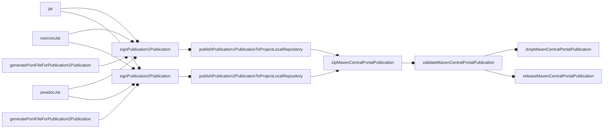
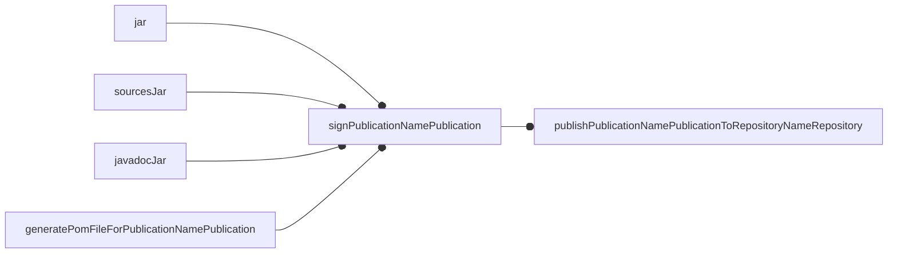

# publish-on-central

A Gradle plugin for streamlined publishing to Maven Central.

For publishing to Nexus repositories, please use version 8.x.x or earlier: support for Nexus was removed in 9.x.x as OSSRH was sunset on June 30, 2025.

## Rationale
Publishing to Maven Central often requires extensive configuration. This plugin simplifies the process by:
- Automatically creating a Maven Central–compatible publication with all required metadata
- Configuring tasks to generate Javadoc and source JARs
- Enabling the signing plugin
- Providing tasks to upload, verify, and release artifacts

Support for Sonatype Nexus repositories was dropped in version 9.x.x. However, all standard Maven repositories—such as GitHub Packages and the Maven Central portal—remain supported.

## Configuration

### Minimal

#### Credentials
The plugin looks for credentials in the following order:

1. **Environment variables**:
    - `MAVEN_CENTRAL_PORTAL_USERNAME`
    - `MAVEN_CENTRAL_PORTAL_PASSWORD`
2. **Fallback environment variables**:
    - `MAVEN_CENTRAL_USERNAME`
    - `MAVEN_CENTRAL_PASSWORD`
3. **[Gradle properties](https://docs.gradle.org/current/userguide/build_environment.html#sec:gradle_configuration_properties)**:
    - `mavenCentralPortalUsername`
    - `mavenCentralPortalPassword`
4. **Legacy Sonatype properties**:
    - `sonatypeUsername`
    - `sonatypePassword`
    - `ossrhUsername`
    - `ossrhPassword`

You can obtain credentials from the [Maven Central Portal](https://central.sonatype.com/).

#### Gradle configuration

```kotlin
plugins {
    id ("org.danilopianini.publish-on-central") version "<pick the latest>"
}
group = "your.group.id" // This must be configured for the generated pom.xml to work correctly
publishOnCentral {
  repoOwner.set("Your-GitHub-username")
  projectDescription.set("A reasonable description")
}
publishing {
  publications {
    withType<MavenPublication> {
      pom {
        developers {
          developer {
            name.set("Danilo Pianini")
            email.set("danilo.pianini@gmail.com")
            url.set("http://www.danilopianini.org/")
          }
        }
      }
    }
  }
}
signing {
  val signingKey: String? by project
  val signingPassword: String? by project
  useInMemoryPgpKeys(signingKey, signingPassword)
}
```

### Complete


```kotlin
plugins {
    id ("org.danilopianini.publish-on-central") version "<pick the latest>"
}
```

The plugin is configured to react to the application of the `java` plugin,
and to apply the `maven-publish` and `signing` plugin if they are not applied.

```kotlin
// The package name is equal to the project name
group = "your.group.id" // This must be configured for the generated pom.xml to work correctly
/*
 * The plugin comes with defaults that are useful to myself. You should configure it to behave as you please:
 */
publishOnCentral {
    repoOwner.set("Your-GitHub-username") // Used to populate the default value for projectUrl and scmConnection
    projectDescription.set("A reasonable description")
    // The following values are the default, if they are ok with you, just omit them
    projectLongName.set(project.name)
    licenseName.set("Apache License, Version 2.0")
    licenseUrl.set("http://www.apache.org/licenses/LICENSE-2.0")
    projectUrl.set("https://github.com/${repoOwner.get()}/${project.name}")
    scmConnection.set("scm:git:https://github.com/${repoOwner.get()}/${project.name}")

    /*
     * The publications can be sent to other destinations, e.g. GitHub
     * The task name would be 'publishAllPublicationsToGitHubRepository'
     */
    repository("https://maven.pkg.github.com/OWNER/REPOSITORY", "GitHub") {
        user.set(System.getenv("GITHUB_USERNAME"))
        password.set(System.getenv("GITHUB_TOKEN"))
    }
}

/*
 * Developers and contributors must be added manually
 */
publishing {
    publications {
        withType<MavenPublication> {
            pom {
                developers {
                    developer {
                        name.set("Danilo Pianini")
                        email.set("danilo.pianini@gmail.com")
                        url.set("http://www.danilopianini.org/")
                    }
                }
            }
        }
    }
}

/*
 * The plugin automatically adds every publication to the list of objects to sign
 * The configuration of the signing process is left to the user, though,
 * as in a normal Gradle build.
 * In the following example, in-memory signing is configured.
 * For further options, please refer to: https://docs.gradle.org/current/userguide/signing_plugin.html
 */
signing {
    val signingKey: String? by project
    val signingPassword: String? by project
    useInMemoryPgpKeys(signingKey, signingPassword)
}

```

## Dokka

If the dokka plugin is applied, the plugin reacts automatically and uses the HTML output as the javadoc jar.
Contextually, this plugin disables all `javadoc` tasks, as they are not needed anymore.

## Kotlin Multiplatform

This plugin reacts to the application of the Kotlin Multiplatform plugin
by generating a Javadoc Jar for each KMP publication:
unfortunately, Kotlin Multiplatform pre-initializes a sources jar, but not a javadoc jar.
For Kotlin Multiplatform, no special publications are created,
this plugins configures the existing ones to be compatible with Maven Central.

## Tasks

* `sourcesJar`: a `Jar` task preconfigured to collect and pack `allSource` from the `main` source set
* `javadocJar`: a `Jar` task preconfigured to
    1. package the output of `Javadoc` tasks, if the `java` plugin has been applied; or
    2. package the output of the Dokka HTML plugin, if the Dokka Gradle plugin has been applied; or
    3. generate an empty jar, otherwise.
* A publication named `OSSRH` for each Java, Scala, or Kotlin/JVM repository and relative publication tasks;
  unless manually deactivated, a `MavenCentral` repository is created by default.
* One publishing task for publishing `All` software components to any target repository
* For every repository with an associated Sonatype Nexus instance, additional tasks are generated to control the
  creation, upload, closure, and release of staging repositories.

### Maven Central Portal publishing

Maven Central recently introduced a new portal for managing the artifacts,
which replaced the Nexus-based publishing.
Publishing on the Central Portal goes through the following steps:
1. the publication is uploaded to project-local maven repository
2. the local repository is zipped
3. the bundle is then uploaded to the portal and validated
4. once the validation is complete, the bundle is released or dropped

The lifecycle is summarized in the following diagram:


In short, select the publications you wish to publish (most likely, the `OSSRH` publication),
and use the `publish<PublicationName>PublicationToProjectLocalRepository` task to enqueue them for upload,
then use the `zipMavenCentralPortalPublication` to create a bundle.
Now, you can interact with the portal using the (`validate`/`release`/`drop`)`MavenCentralPortalPublication` tasks.
A typical invocation could be:

```console
$ ./gradlew publishAllPublicationsToProjectLocalRepository zipMavenCentralPortalPublication releaseMavenCentralPortalPublication
```

If you already have an uploaded bundle and want to manage it using this plugin,
set the `publishDeploymentId` property to the deployment ID of the bundle you want to manage, e.g.:

```console
$ ./gradlew -PpublishDeploymentId=8697a629-c07d-4349-9a3f-0f52f3ba74fb dropMavenCentralPortalPublication
```

If `publishDeploymentId` is set, no upload will be performed.

### Excluding large shadowJars / uberJars / fatJars

If you produce a shadow jar with the [Shadow plugin](https://imperceptiblethoughts.com/shadow/introduction/),
you will find the jar with `all` classifier as part of the OSSRH publication.
To avoid publishing the shadow jar, you can skip the `shadowRuntimeElements` variant.
Gradle's `ComponentWithVariants` API lets you hook into any configuration
that's been turned into a "variant" on a component
(and Shadow adds its `shadowRuntimeElements` as such).
Calling `skip()` simply means "don’t expose this variant in any publications".

```kotlin
afterEvaluate {
    components.withType<AdhocComponentWithVariants>().named("java").configure {
        // Shadow creates a "shadowRuntimeElements" configuration which is added as a variant
        withVariantsFromConfiguration(configurations["shadowRuntimeElements"]) {
            skip()
        }
    }
}
```

### Publishing to classic Maven repositories

Launching the `publish[PublicationName]PublicationTo[RepositoryName]Repository` triggers the creation of the required components,
their signing, and the upload on the target repository.



## Usage examples

If you use publish-on-central in your project, please consider providing a pull request with a link to your project:
it will provide useful use cases for newcomers to look at.

### Java, simple project, kts build file
* [**gson-extras**](https://github.com/DanySK/gson-extras): extra goodies for Google Gson
* [**JIRF**](https://github.com/DanySK/jirf/): an implicit reflective factory
* [**java-quadtree**](https://github.com/DanySK/java-quadtree/): a quadtree written in Java

### Java, multiproject, kts build file
* [**Protelis**](https://github.com/Protelis/Protelis): an aggregate programming language

### Java + Kotlin-jvm + Scala + Kotlin multiplatform, multiproject, kts build file
* [**Alchemist Simulator**](https://github.com/AlchemistSimulator/Alchemist): a simulator for computational ecosystems
* 
### Kotlin-jvm, simple project, kts build file
* [**khttp**](https://github.com/DanySK/khttp): Kotlin HTTP requests library

### Kotlin-jvm, multiproject, kts build file
* [**JaKtA**](https://github.com/jakta-bdi/jakta): JaKtA is a Kotlin internal DSL for the definition of BDI agents.
  
### Kotlin-jvm, Gradle plugin, simple project, kts build file
* [**multi-jvm-test-plugin**](https://github.com/DanySK/multi-jvm-test-plugin): Automatic configuration of Gradle's toolchains for multi-JVM testing
* [**ProtelisDoc**](https://github.com/Protelis/ProtelisDoc): Dokka-based documentation engine for Protelis
* **publish-on-central** (yes, this plugin uses itself for publishing)
* [**conventional-commits**](https://github.com/nicolasfara/conventional-commits): Gradle plugin to check if commits are Conventional Commits compliant

### Kotlin-multiplatform
* [**Template for Kotlin Multiplatform projects**](https://github.com/DanySK/Template-for-Kotlin-Multiplatform-Projects): a project template for quickly spawning new Kotlin-multiplatform projects
* [**yoki**](https://github.com/DevNatan/yoki): Kotlin Docker Remote API client
* [**collektive**](https://github.com/Collektive/collektive): Aggregate Computing in Kotlin Multiplatform
* [**pulvreakt**](https://github.com/pulvreakt/pulvreakt): Pulverization framework in Kotlin Multiplatform 

## Contributing to the project

I gladly review pull requests and I'm happy to improve the work.
If the software was useful to you, please consider supporting my development activity
[](https://www.paypal.com/cgi-bin/webscr?cmd=_donations&business=5P4DSZE5DV4H2&currency_code=EUR)
